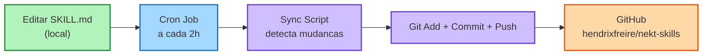

# Nekt Skills

Skills do [Hermes Agent](https://github.com/hendrixfreire/hermes-agent) para o MCP da **Nekt** — plataforma de dados.

## Skills

| Skill | Descricao |
|---|---|
| `nekt-connection-test` | Testa a conexao com o MCP da Nekt |
| `nekt-client-report` | Relatorio consolidado de performance por cliente (Gold) |
| `nekt-schema-explorer` | Descobre e documenta a estrutura de tabelas nas 3 camadas |
| `nekt-campaign-diagnostics` | Diagnostico de campanhas com performance atipica |
| `nekt-data-freshness-check` | Valida atualizacao dos dados no data lake |

## Auto-Sync Pipeline

Este repositorio tem sincronizacao **automatica** com o Hermes Agent — voce edita as skills localmente e o cron job sobe para o GitHub.

### Diagrama de fluxo



> Diagrama interativo (estilo hand-drawn): [abrir no Excalidraw](https://excalidraw.com/#json=HueWEUf24dr9yz6ikFGZ7,Pr1fyzSryJY1tMTfZxaEhw)
>
> Arquivo fonte: `diagrams/nekt-skills-sync.excalidraw` (abra arrastando em [excalidraw.com](https://excalidraw.com))

### Como funciona

| Etapa | O que acontece |
|---|---|
| **1. LOCAL** | Voce cria ou edita skills em `~/.hermes/skills/nekt/<nome>/SKILL.md` |
| **2. CRON** | O job `nekt-skills-auto-sync` roda automaticamente a cada 2h |
| **3. SCRIPT** | O script `nekt-skills-sync.py` detecta mudancas via `git status` |
| **4. SYMLINK** | Skills sao acessiveis por symlinks em `~/.hermes/skills/<nome>/` → `nekt/<nome>/` |
| **5. GIT** | Faz `git add -A`, `git commit`, `git push` |
| **6. GITHUB** | O repositorio `hendrixfreire/nekt-skills` e atualizado |

**Key Principle:** Edite skills localmente. O cron sobe pro GitHub.

### Logs

Os logs do sync ficam em `~/.hermes/logs/nekt-skills-sync.log`.

---

## Como usar

Clone este repositorio e crie symlinks na raiz de `~/.hermes/skills/`:

```bash
git clone https://github.com/hendrixfreire/nekt-skills.git ~/.hermes/skills/nekt
# Criar symlinks para cada skill (necessario para o Hermes carregar):
cd ~/.hermes/skills
for skill in nekt-connection-test nekt-client-report nekt-schema-explorer nekt-campaign-diagnostics nekt-data-freshness-check; do
  ln -sf nekt/$skill $skill
done
```

## Desenvolvimento

Para criar uma nova skill:

1. Crie `<nome>/SKILL.md` dentro do repositorio local (`~/.hermes/skills/nekt/`)
2. O cron job detecta e sobe automaticamente em ate 2h
3. Para subir na hora: `cd ~/.hermes/skills/nekt && git add -A && git commit -m "sua mensagem" && git push`
